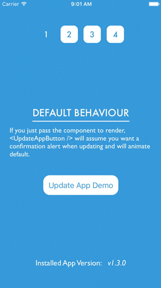

React Native CodePush Update Button
===================================

[CodePush](https://microsoft.github.io/code-push/) is a really great tool to deploy React Native app updates directly to our users' devices without the need of going through the App or Play Store. Sometimes, however, we need to explicitly prompt our users to update the app, as opposed to silently updating it in the background. The goal of `react-native-cp-update-button` is to make this updating workflow straight forward and quick to implement.



> Currently only iOS is supported, however Android support will land shortly!

* [Installation](#installation)
* [Demo & Example](#example--demo)
* [Components](#components)
	* [`<UpdateAppButton />`](#updateappbutton--)
	* [`<AppVersion />`](#appversion-)
	* [`<Middot />`](#middot-)
* [Deploying Updates](#deploying-updates)
* [Basic Usage](#basic-usage)
* [Advanced Usage](#advanced-usage)

## Installation
```
npm install --save react-native-cp-update-button
```

Note, `react-native-cp-update-button` also requires on the following dependencies:
- [React Native](https://facebook.github.io/react-native/) 15.0 or later
- [React](https://facebook.github.io/react/) 0.15 or later
- [React Native Code Push](https://github.com/Microsoft/react-native-code-push) 1.12.2-beta or later

## Example & Demo
```
git clone https://github.com/cameronbourke/react-native-cp-update-button
cd react-native-cp-update-button
npm install
cd example/UpdateButtonDemo
npm install
```

Then open the Xcode project at `ios/UpdateButtonDemo.xcodeproj`

Currently `npm link` does not work with React Native's packager, so, to temporarily get around that, `npm start` actually runs a babel command that will output the `/src` directory into `/example/UpdateButtonDemo/dev` which explains why you will see the following when in the example app:

```js
import {
	UpdateAppButton,
	Middot,
	AppVersion
} from './dev/react-native-cp-update-button';
```

#### Changing the CodePush Deployment Key

In order to get CodePush working for the example, you will need to change the deployment key for the iOS app. First you will need to [create a CodePush app](https://github.com/Microsoft/code-push/tree/master/cli#app-management), and then change the value of `CodePushDeploymentKey` in the `info.plist` to the staging key of the app you just created to using the `code-push cli`.


## Components
`react-native-cp-update-button` is made up of three React components that provide the building blocks to quickly add a button to allow your users to update their version of the app installed.

#### `<UpdateAppButton />`
This component gives you the ability to simply invoke a function to show a confirmation prompt to the user that will update the app immediately when the confirmation button is pressed.

| Property          | Type     | Default     | Description
|------------------ | -------- | ----------- | --------
| animate           | boolean  | true        | LayoutAnimation.configureNext will be called when a new version becomes available, animating any layout change in the next render
| component         | function | (required)  | react component will be rendered, [see usage for more details](#basic-version)
| updateOnPress     | bool     | false       | whether to update the app immediately without showing the confirm prompt
| promptTitle       | string   | New Update Available | short title of the confirmation prompt shown to the user
| promptMessage     | string   | A new update is now available. Do you want to update now? Note: Updating will restart the app and any changes not saved will be lost. | body of the confirmation prompt shown to the user
| confirmButtonText | string   | Update Now  | the text for the confirmation prompt's confirm button

#### `<AppVersion />`
This component will display the installed CodePush version, **not** the binary version of the app. Make sure to read over [Deploying Updates](#deploying-updates) to understand how to set the app version.

| Property          | Type     | Default         | Description
|------------------ | -------- | --------------- | --------
| binary            | string   | true (required) | if there are not any installs from CodePush yet on the device, no value for the version is returned and therefore you need to specific what the binary version of the installed app was
| style             | object   |                 | accepts all the style properties for the <Text /> component

#### `<Middot />`
A common pattern these days is to show a middot to indicate there is a notification component, think Slack for example. To save you building your own, you can import one prepared a little earlier.

| Property          | Type     | Default      | Description
|------------------ | -------- | ------------ | --------
| color             | string   | #e74c3c      | background color for the outer circle
| size              | number   |  22          | specifies the size of the outer circle


## Deploying Updates
One of best parts about `react-native-cp-update-button` is that it does not require any new tooling, you can just use the `code-push cli` like you normally would to push updates to your React Native app. Everything that the components need to know is achieved by using a stringified object as the value for the `--description` option in the cli. The object can have the following properties:

> Note: if the object is not stringified correctly, none of the data within the object will be used and instead will fall back to the default values

| Property          | Description
|------------------ | --------
| version           | the version number that <AppVersion /> will display
| promptTitle       | *same as `<UpdateAppButton />`*   
| promptMessage     | *same as `<UpdateAppButton />`*   
| confirmButtonText | *same as `<UpdateAppButton />`*   

If there is value for `promptTitle, promptMessage` or `confirmButtonText` in the object, it has a higher priority over the corresponding value/s that were passed as props to `<UpdateAppButton />` and therefore will be used by the component.

### Example Deployment
Say you are happy with `v1.3.0`, you tag it (hopefully) and are about to release it using CodePush like you normally would. The only difference is now you will need to add the `--description` option and pass it a value. In this example, you are giving the update a version number, which will be used by `<AppVersion />`, and a promptMessage which will be displayed within the body of the confirmation prompt. Voilà, deployment using an update button done!

```
code-push release-react YourApp ios -d Production --description '{"version":"1.3.0", "promptMessage": "There are plenty of new features in this goodie of an update"}'
```

## Basic Usage
The gist of how this works is that you need to create a component to pass to `<UpdateAppButton />`. In the example below, `AppLogo` is a simple component that renders an image of the app logo and only shows `<Middot />` when a new version is available for the user to download. Notice, the component has access to two props:
- **newVersion**: either will be `null` if there is no new version, or a `CodePush` [localPackage](https://github.com/Microsoft/react-native-code-push#localpackage)
- **shownUpdatePrompt**: function that when called will show a confirmation prompt to update the app

```js
import { AppUpdateButton, Middot, AppVersion } from 'react-native-cp-update-button';

const AppLogo = ({ newVersion, shownUpdatePrompt }) => (
	<TouchableOpacity
		disabled={!newVersion}
		onPress={shownUpdatePrompt}>
		{newVersion ? <Middot /> : null}
		<Image src={require('../img/example-logo.png')} />
	</TouchableOpacity>
);
```

Now all that is left to do is to render these components. You don't need to have both `UpdateAppButton` and `AppVersion` together, but for the sake of simplification the `App` component below does.  
```js
class App extends React.Component {
	...
	render () {
		return (
			<View>
				...
				<UpdateAppButton component={AppLogo} />
				<AppVersion binary='1.0.0' />
			</View>
		)
	}
}
```
The behaviour of this example will follow:
- When there is a new CodePush version available, the `TouchableOpacity` will stop being disabled, and the `Middot` will appear.
- This will inform the end user that there is a new version ready to install.
- Once the end user presses on `AppLogo`, the `shownUpdatePrompt` function passed to down as props will be called.
- This will cause a confirmation prompt to appear, using the `default props` for the title, message and confirmation button.
- Once the end user presses the "Update Now" button, the app will restart with that new version immediately.

## Advanced Usage
For more advanced usages for `react-native-cp-update-button`, check out examples `2 & 3` within the example app. For an example on how to animate the update button without using the default animation, check out example `4`. This will outline how you can utilise React Native's `Animate API` to achieve more complex interactions and animations when a new version becomes available.
